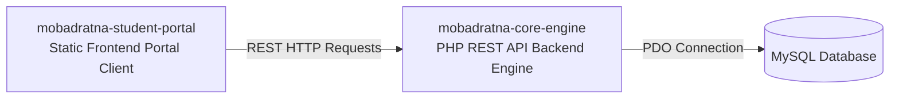

# 🤝 أهلاً بكم في منظمة مبادرتنا | Welcome to Mobadratna Organization

  

منصة **مبادرتنا** هي بيئة عمل برمجية متكاملة ومفتوحة المصدر لربط ومساندة المبادرات الطلابية والمشاريع الجامعية بالتطوع الطلابي الفعال. تهدف المنصة لتسهيل عمليات التقديم والقبول وإصدار الإحصائيات الإدارية لمسؤولي الأنشطة.

**Mobadratna** is an integrated open-source software ecosystem designed to organize, track, and empower student initiatives and graduation projects through voluntary support. The platform facilitates registrations, volunteer matches, and administrative analytics dashboards.

---

## 🧬 النظام البيئي للمنصة | Ecosystem Architecture

يتكون النظام من مستودعين رئيسيين يتكاملان لتوفير بيئة عمل آمنة وسلسة للطلاب والإداريين:

---

## 📂 مستودعات المنصة (Our Repositories)

| المستودع (Repository) | النوع | الوصف (Description) | الشارات التقنية (Tech Badges) |
| :--- | :--- | :--- | :--- |
| 💻 **[mobadratna-student-portal](https://github.com/Mobadratna-Org/mobadratna-student-portal)** | Frontend | البوابة الإلكترونية التفاعلية المخصصة للطلاب واستعراض الأنشطة والتقديم للتطوع. |    |
| ⚙️ **[mobadratna-core-engine](https://github.com/Mobadratna-Org/mobadratna-core-engine)** | Backend | محرك خادم البيانات المبني بلغة PHP والمسؤول عن الأمان وإدارة الجلسات وقبول طلبات الطلاب. |   |

---

## 🛠️ التقنيات الأساسية (Core Tech Stack)
*   **Frontend**: Semantic HTML5, Responsive CSS3 Grid/Flexbox, Cairo Web Fonts, Vanilla JS DOM controllers.
*   **Backend & DB**: Clean Raw PHP 8.x routing handlers, PDO Connection protection, custom Session handlers, MySQL relational storage.

---

## 👥 فريق العمل والمساهمون (Contributors)
*   **سيد حرز الله** - Lead Software Architect & Systems Developer.
